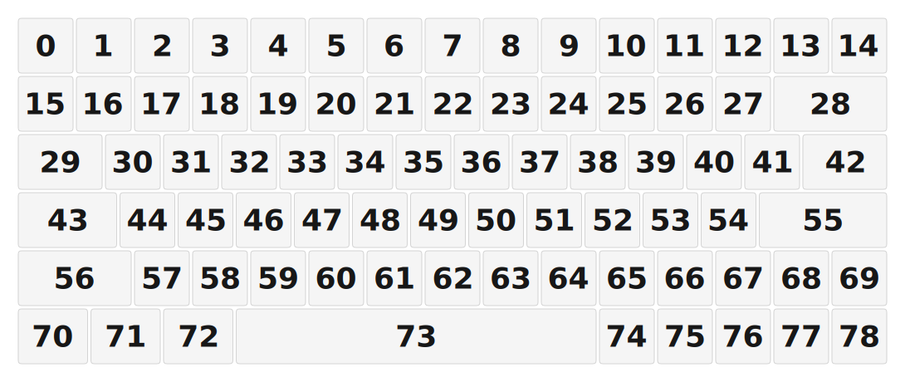

# ZMK Configuration for gy79

*Generated by Shield Wizard for ZMK*



Download compiled firmware from the Actions tab. <https://zmk.dev/docs/user-setup#installing-the-firmware>

Edit your keymap <https://zmk.dev/docs/keymaps>.
User keymap is located at [`config/gy79.keymap`](config/gy79.keymap).

-----

<details>
<summary>
Shield Wizard Debug Information
</summary>

In case of broken configuration, here is the Shield Wizard internal data used to generate this configuration:

Commit: 8a52249f61161469b6d90ed8c80c4aa52b9f3858

```json
{"name":"gy79","shield":"gy79","dongle":false,"modules":[],"layout":[{"id":"01KJN4A1B1CQ583T8PY83T98EY","part":0,"row":0,"col":0,"w":1,"h":1,"x":0,"y":0,"r":0,"rx":0,"ry":0},{"id":"01KJN4A1B1NHAB5H1E080JHTJA","part":0,"row":0,"col":1,"w":1,"h":1,"x":1,"y":0,"r":0,"rx":0,"ry":0},{"id":"01KJN4A1B112E506HKKBCN2XNV","part":0,"row":0,"col":2,"w":1,"h":1,"x":2,"y":0,"r":0,"rx":0,"ry":0},{"id":"01KJN4A1B1ASBVVJM9VC6KJN8P","part":0,"row":0,"col":3,"w":1,"h":1,"x":3,"y":0,"r":0,"rx":0,"ry":0},{"id":"01KJN4A1B1C53CH3BV29778114","part":0,"row":0,"col":4,"w":1,"h":1,"x":4,"y":0,"r":0,"rx":0,"ry":0},{"id":"01KJN4A1B1PSBSR3SRRB09Y3YV","part":0,"row":0,"col":5,"w":1,"h":1,"x":5,"y":0,"r":0,"rx":0,"ry":0},{"id":"01KJN4A1B1DTNT904RGG2X8S2X","part":0,"row":0,"col":6,"w":1,"h":1,"x":6,"y":0,"r":0,"rx":0,"ry":0},{"id":"01KJN4A1B1N4DHKRE6KMV3J1H2","part":0,"row":0,"col":7,"w":1,"h":1,"x":7,"y":0,"r":0,"rx":0,"ry":0},{"id":"01KJN4A1B1XVW8V36VZ1GDRJQS","part":0,"row":0,"col":8,"w":1,"h":1,"x":8,"y":0,"r":0,"rx":0,"ry":0},{"id":"01KJN4A1B17RGY7ZH4JHBRHCMN","part":0,"row":0,"col":9,"w":1,"h":1,"x":9,"y":0,"r":0,"rx":0,"ry":0},{"id":"01KJN4A1B1E6KN71DNYQSVB3ZW","part":0,"row":0,"col":10,"w":1,"h":1,"x":10,"y":0,"r":0,"rx":0,"ry":0},{"id":"01KJN4A1B1XQYK9TP02D7DK0R3","part":0,"row":0,"col":11,"w":1,"h":1,"x":11,"y":0,"r":0,"rx":0,"ry":0},{"id":"01KJN4A1B1H2WRANNW0WRF0WP8","part":0,"row":0,"col":12,"w":1,"h":1,"x":12,"y":0,"r":0,"rx":0,"ry":0},{"id":"01KJN4A1B1YNDJ0RCEN8PFRP5M","part":0,"row":0,"col":13,"w":1,"h":1,"x":13,"y":0,"r":0,"rx":0,"ry":0},{"id":"01KJN4A1B1XZSEY277878X9GBB","part":0,"row":0,"col":14,"w":1,"h":1,"x":14,"y":0,"r":0,"rx":0,"ry":0},{"id":"01KJN4A1B1DS1R6Z8SS15ZZWN3","part":0,"row":1,"col":0,"w":1,"h":1,"x":0,"y":1,"r":0,"rx":0,"ry":0},{"id":"01KJN4A1B16QQZ6S7ZDHRXFWH5","part":0,"row":1,"col":1,"w":1,"h":1,"x":1,"y":1,"r":0,"rx":0,"ry":0},{"id":"01KJN4A1B1YD1BG9Y9Q609D68J","part":0,"row":1,"col":2,"w":1,"h":1,"x":2,"y":1,"r":0,"rx":0,"ry":0},{"id":"01KJN4A1B1XBH0H5TYD5MANP48","part":0,"row":1,"col":3,"w":1,"h":1,"x":3,"y":1,"r":0,"rx":0,"ry":0},{"id":"01KJN4A1B1CA4G9S4KE4GVJCF0","part":0,"row":1,"col":4,"w":1,"h":1,"x":4,"y":1,"r":0,"rx":0,"ry":0},{"id":"01KJN4A1B1EVZCMAVRGZ6M1D2T","part":0,"row":1,"col":5,"w":1,"h":1,"x":5,"y":1,"r":0,"rx":0,"ry":0},{"id":"01KJN4A1B1DDBC355PTA5FX0ZH","part":0,"row":1,"col":6,"w":1,"h":1,"x":6,"y":1,"r":0,"rx":0,"ry":0},{"id":"01KJN4A1B19VQXNFBRKX7EA04M","part":0,"row":1,"col":7,"w":1,"h":1,"x":7,"y":1,"r":0,"rx":0,"ry":0},{"id":"01KJN4A1B156CP0MVN9NTHD7WE","part":0,"row":1,"col":8,"w":1,"h":1,"x":8,"y":1,"r":0,"rx":0,"ry":0},{"id":"01KJN4A1B10PSVNX73WAZ068R6","part":0,"row":1,"col":9,"w":1,"h":1,"x":9,"y":1,"r":0,"rx":0,"ry":0},{"id":"01KJN4A1B1SDV1B7GWQRVBDGAC","part":0,"row":1,"col":10,"w":1,"h":1,"x":10,"y":1,"r":0,"rx":0,"ry":0},{"id":"01KJN4A1B1GHHD57NPGMN7SMAX","part":0,"row":1,"col":11,"w":1,"h":1,"x":11,"y":1,"r":0,"rx":0,"ry":0},{"id":"01KJN4A1B1H8AKA6Y50FZMPJQC","part":0,"row":1,"col":12,"w":1,"h":1,"x":12,"y":1,"r":0,"rx":0,"ry":0},{"id":"01KJN4A1B1AHR5M0EA2T420STB","part":0,"row":1,"col":13,"w":2,"h":1,"x":13,"y":1,"r":0,"rx":0,"ry":0},{"id":"01KJN4A1B1GB1GCN4MJC0EWWTJ","part":0,"row":2,"col":0,"w":1.5,"h":1,"x":0,"y":2,"r":0,"rx":0,"ry":0},{"id":"01KJN4A1B1ZGTN9HJXYA11W71A","part":0,"row":2,"col":1,"w":1,"h":1,"x":1.5,"y":2,"r":0,"rx":0,"ry":0},{"id":"01KJN4A1B1D63DGS3CMRYSF62D","part":0,"row":2,"col":2,"w":1,"h":1,"x":2.5,"y":2,"r":0,"rx":0,"ry":0},{"id":"01KJN4A1B13JG2ZR3D3VGRBS1H","part":0,"row":2,"col":3,"w":1,"h":1,"x":3.5,"y":2,"r":0,"rx":0,"ry":0},{"id":"01KJN4A1B25JN7X7YWQ1CNCMZ1","part":0,"row":2,"col":4,"w":1,"h":1,"x":4.5,"y":2,"r":0,"rx":0,"ry":0},{"id":"01KJN4A1B2QVYMB16WGYKGQCCD","part":0,"row":2,"col":5,"w":1,"h":1,"x":5.5,"y":2,"r":0,"rx":0,"ry":0},{"id":"01KJN4A1B2BNSEP5RJVP2D37T6","part":0,"row":2,"col":6,"w":1,"h":1,"x":6.5,"y":2,"r":0,"rx":0,"ry":0},{"id":"01KJN4A1B2N0ZA5HWHV8N6S6MJ","part":0,"row":2,"col":7,"w":1,"h":1,"x":7.5,"y":2,"r":0,"rx":0,"ry":0},{"id":"01KJN4A1B2EWQDSPP0AZEM7694","part":0,"row":2,"col":8,"w":1,"h":1,"x":8.5,"y":2,"r":0,"rx":0,"ry":0},{"id":"01KJN4A1B23PP3QHX49Q1DTJ9R","part":0,"row":2,"col":9,"w":1,"h":1,"x":9.5,"y":2,"r":0,"rx":0,"ry":0},{"id":"01KJN4A1B25DVW05QC5ZVCTR7B","part":0,"row":2,"col":10,"w":1,"h":1,"x":10.5,"y":2,"r":0,"rx":0,"ry":0},{"id":"01KJN4A1B2CA11HSMGE17GBMYZ","part":0,"row":2,"col":11,"w":1,"h":1,"x":11.5,"y":2,"r":0,"rx":0,"ry":0},{"id":"01KJN4A1B2Z9NFZT3S1N5R6N5X","part":0,"row":2,"col":12,"w":1,"h":1,"x":12.5,"y":2,"r":0,"rx":0,"ry":0},{"id":"01KJN4A1B24WE400VFP71RY0ZR","part":0,"row":2,"col":13,"w":1.5,"h":1,"x":13.5,"y":2,"r":0,"rx":0,"ry":0},{"id":"01KJN4A1B2HH12Q6ZTZ0H65AKC","part":0,"row":3,"col":0,"w":1.75,"h":1,"x":0,"y":3,"r":0,"rx":0,"ry":0},{"id":"01KJN4A1B2SHTD39PM4EN0Q429","part":0,"row":3,"col":1,"w":1,"h":1,"x":1.75,"y":3,"r":0,"rx":0,"ry":0},{"id":"01KJN4A1B2847FCEGB95G0ST4P","part":0,"row":3,"col":2,"w":1,"h":1,"x":2.75,"y":3,"r":0,"rx":0,"ry":0},{"id":"01KJN4A1B2VFQ61SM9ZD40CF1X","part":0,"row":3,"col":3,"w":1,"h":1,"x":3.75,"y":3,"r":0,"rx":0,"ry":0},{"id":"01KJN4A1B2XWQD9N0EQJH68ZCN","part":0,"row":3,"col":4,"w":1,"h":1,"x":4.75,"y":3,"r":0,"rx":0,"ry":0},{"id":"01KJN4A1B2KV04ZEQTN3ZKQVG4","part":0,"row":3,"col":5,"w":1,"h":1,"x":5.75,"y":3,"r":0,"rx":0,"ry":0},{"id":"01KJN4A1B2P4QV61YVKF9HWMQX","part":0,"row":3,"col":6,"w":1,"h":1,"x":6.75,"y":3,"r":0,"rx":0,"ry":0},{"id":"01KJN4A1B28CJ7RGTTN0KCT567","part":0,"row":3,"col":7,"w":1,"h":1,"x":7.75,"y":3,"r":0,"rx":0,"ry":0},{"id":"01KJN4A1B2KH6WT44KXDT2KE3M","part":0,"row":3,"col":8,"w":1,"h":1,"x":8.75,"y":3,"r":0,"rx":0,"ry":0},{"id":"01KJN4A1B2123T6J2A39HRJCES","part":0,"row":3,"col":9,"w":1,"h":1,"x":9.75,"y":3,"r":0,"rx":0,"ry":0},{"id":"01KJN4A1B2S6Z4JA58X1HWTPVF","part":0,"row":3,"col":10,"w":1,"h":1,"x":10.75,"y":3,"r":0,"rx":0,"ry":0},{"id":"01KJN4A1B2W6EKAZW19ME51RHX","part":0,"row":3,"col":11,"w":1,"h":1,"x":11.75,"y":3,"r":0,"rx":0,"ry":0},{"id":"01KJN4A1B2HEDF64B6EFAR6TA8","part":0,"row":3,"col":13,"w":2.25,"h":1,"x":12.75,"y":3,"r":0,"rx":0,"ry":0},{"id":"01KJN4A1B2HD1HP4AB2VWV0C8K","part":0,"row":4,"col":0,"w":2,"h":1,"x":0,"y":4,"r":0,"rx":0,"ry":0},{"id":"01KJN4A1B2EVASWQ7AX7QFMM5X","part":0,"row":4,"col":2,"w":1,"h":1,"x":2,"y":4,"r":0,"rx":0,"ry":0},{"id":"01KJN4A1B2PR7JNCTMS2T582PS","part":0,"row":4,"col":3,"w":1,"h":1,"x":3,"y":4,"r":0,"rx":0,"ry":0},{"id":"01KJN4A1B2GJWJD2YG29PQF6XP","part":0,"row":4,"col":4,"w":1,"h":1,"x":4,"y":4,"r":0,"rx":0,"ry":0},{"id":"01KJN4A1B22YBXNG9ZKHSE0W3Z","part":0,"row":4,"col":5,"w":1,"h":1,"x":5,"y":4,"r":0,"rx":0,"ry":0},{"id":"01KJN4A1B2YCXH123Y8G6V6VX4","part":0,"row":4,"col":6,"w":1,"h":1,"x":6,"y":4,"r":0,"rx":0,"ry":0},{"id":"01KJN4A1B2NJRGGDYPHVGGJ6V0","part":0,"row":4,"col":7,"w":1,"h":1,"x":7,"y":4,"r":0,"rx":0,"ry":0},{"id":"01KJN4A1B2S4A8SFEQD522YK37","part":0,"row":4,"col":8,"w":1,"h":1,"x":8,"y":4,"r":0,"rx":0,"ry":0},{"id":"01KJN4A1B2N8FEB9STBVMEKBJ8","part":0,"row":4,"col":9,"w":1,"h":1,"x":9,"y":4,"r":0,"rx":0,"ry":0},{"id":"01KJN4A1B2ZZ66MZAZ44MY4AM3","part":0,"row":4,"col":10,"w":1,"h":1,"x":10,"y":4,"r":0,"rx":0,"ry":0},{"id":"01KJN4A1B2R4H2F33VVMGJWR22","part":0,"row":4,"col":11,"w":1,"h":1,"x":11,"y":4,"r":0,"rx":0,"ry":0},{"id":"01KJN4A1B2JBH9SV6J8VK6EKXJ","part":0,"row":4,"col":12,"w":1,"h":1,"x":12,"y":4,"r":0,"rx":0,"ry":0},{"id":"01KJN4A1B2K1XE40EQ2CMQVFXB","part":0,"row":4,"col":13,"w":1,"h":1,"x":13,"y":4,"r":0,"rx":0,"ry":0},{"id":"01KJN4A1B2WKRKXN5SKYESQ5P0","part":0,"row":4,"col":14,"w":1,"h":1,"x":14,"y":4,"r":0,"rx":0,"ry":0},{"id":"01KJN4A1B2GNFMTDX9KZ6E71PV","part":0,"row":5,"col":0,"w":1.25,"h":1,"x":0,"y":5,"r":0,"rx":0,"ry":0},{"id":"01KJN4A1B2RWV2EMAHQZD1RKVZ","part":0,"row":5,"col":1,"w":1.25,"h":1,"x":1.25,"y":5,"r":0,"rx":0,"ry":0},{"id":"01KJN4A1B2WN14A62G5B050EYE","part":0,"row":5,"col":2,"w":1.25,"h":1,"x":2.5,"y":5,"r":0,"rx":0,"ry":0},{"id":"01KJN4A1B2G1RXS3GA68DNN6XP","part":0,"row":5,"col":6,"w":6.25,"h":1,"x":3.75,"y":5,"r":0,"rx":0,"ry":0},{"id":"01KJN4A1B29WKYXVGESW96PD5N","part":0,"row":5,"col":10,"w":1,"h":1,"x":10,"y":5,"r":0,"rx":0,"ry":0},{"id":"01KJN4A1B2EZPMXPRMM0ETGAQC","part":0,"row":5,"col":11,"w":1,"h":1,"x":11,"y":5,"r":0,"rx":0,"ry":0},{"id":"01KJN4A1B28MZZJJ6A2S3N36T3","part":0,"row":5,"col":12,"w":1,"h":1,"x":12,"y":5,"r":0,"rx":0,"ry":0},{"id":"01KJN4A1B2ZPK84M0G4SX951MK","part":0,"row":5,"col":13,"w":1,"h":1,"x":13,"y":5,"r":0,"rx":0,"ry":0},{"id":"01KJN4A1B2A7ZTAAJAWCZVW8XP","part":0,"row":5,"col":14,"w":1,"h":1,"x":14,"y":5,"r":0,"rx":0,"ry":0}],"parts":[{"name":"unibody","controller":"nice_nano_v2","wiring":"matrix_diode","pins":{"d8":"output","d4":"output","d6":"output","d9":"output","d1":"output","d21":"output","d20":"output","d14":"output","d15":"output","d5":"input","d2":"input","d3":"input","d0":"output","d7":"output","d19":"output","d18":"output","d16":"output","d10":"input","p101":"input","p102":"input","p107":"bus"},"keys":{"01KJN4A1B1CQ583T8PY83T98EY":{"input":"d10","output":"d8"},"01KJN4A1B1DS1R6Z8SS15ZZWN3":{"input":"d5","output":"d8"},"01KJN4A1B1GB1GCN4MJC0EWWTJ":{"input":"p101","output":"d8"},"01KJN4A1B2HH12Q6ZTZ0H65AKC":{"input":"p102","output":"d8"},"01KJN4A1B2HD1HP4AB2VWV0C8K":{"input":"d2","output":"d8"},"01KJN4A1B2GNFMTDX9KZ6E71PV":{"input":"d3","output":"d8"},"01KJN4A1B1NHAB5H1E080JHTJA":{"input":"d10","output":"d4"},"01KJN4A1B16QQZ6S7ZDHRXFWH5":{"input":"d5","output":"d4"},"01KJN4A1B1ZGTN9HJXYA11W71A":{"input":"p101","output":"d4"},"01KJN4A1B2SHTD39PM4EN0Q429":{"input":"p102","output":"d4"},"01KJN4A1B2EVASWQ7AX7QFMM5X":{"input":"d2","output":"d4"},"01KJN4A1B2RWV2EMAHQZD1RKVZ":{"input":"d3","output":"d4"},"01KJN4A1B112E506HKKBCN2XNV":{"input":"d10","output":"d6"},"01KJN4A1B1YD1BG9Y9Q609D68J":{"input":"d5","output":"d6"},"01KJN4A1B1D63DGS3CMRYSF62D":{"input":"p101","output":"d6"},"01KJN4A1B2847FCEGB95G0ST4P":{"input":"p102","output":"d6"},"01KJN4A1B2PR7JNCTMS2T582PS":{"input":"d2","output":"d6"},"01KJN4A1B2WN14A62G5B050EYE":{"input":"d3","output":"d6"},"01KJN4A1B1ASBVVJM9VC6KJN8P":{"input":"d10","output":"d9"},"01KJN4A1B1XBH0H5TYD5MANP48":{"input":"d5","output":"d9"},"01KJN4A1B13JG2ZR3D3VGRBS1H":{"input":"p101","output":"d9"},"01KJN4A1B2VFQ61SM9ZD40CF1X":{"input":"p102","output":"d9"},"01KJN4A1B2GJWJD2YG29PQF6XP":{"input":"d2","output":"d9"},"01KJN4A1B2G1RXS3GA68DNN6XP":{"input":"d3","output":"d1"},"01KJN4A1B1PSBSR3SRRB09Y3YV":{"input":"d10","output":"d1"},"01KJN4A1B1EVZCMAVRGZ6M1D2T":{"input":"d5","output":"d1"},"01KJN4A1B2QVYMB16WGYKGQCCD":{"input":"p101","output":"d1"},"01KJN4A1B2KV04ZEQTN3ZKQVG4":{"input":"p102","output":"d1"},"01KJN4A1B2YCXH123Y8G6V6VX4":{"input":"d2","output":"d1"},"01KJN4A1B1N4DHKRE6KMV3J1H2":{"input":"d10","output":"d21"},"01KJN4A1B19VQXNFBRKX7EA04M":{"input":"d5","output":"d21"},"01KJN4A1B156CP0MVN9NTHD7WE":{"input":"d5","output":"d20"},"01KJN4A1B2N0ZA5HWHV8N6S6MJ":{"input":"p101","output":"d21"},"01KJN4A1B28CJ7RGTTN0KCT567":{"input":"p102","output":"d21"},"01KJN4A1B2S4A8SFEQD522YK37":{"input":"d2","output":"d21"},"01KJN4A1B1XVW8V36VZ1GDRJQS":{"input":"d10","output":"d20"},"01KJN4A1B2EWQDSPP0AZEM7694":{"input":"p101","output":"d20"},"01KJN4A1B2KH6WT44KXDT2KE3M":{"input":"p102","output":"d20"},"01KJN4A1B2N8FEB9STBVMEKBJ8":{"input":"d2","output":"d20"},"01KJN4A1B17RGY7ZH4JHBRHCMN":{"input":"d10","output":"d14"},"01KJN4A1B10PSVNX73WAZ068R6":{"input":"d5","output":"d14"},"01KJN4A1B23PP3QHX49Q1DTJ9R":{"input":"p101","output":"d14"},"01KJN4A1B2123T6J2A39HRJCES":{"input":"p102","output":"d14"},"01KJN4A1B2ZZ66MZAZ44MY4AM3":{"input":"d2","output":"d14"},"01KJN4A1B29WKYXVGESW96PD5N":{"input":"d3","output":"d14"},"01KJN4A1B1H2WRANNW0WRF0WP8":{"input":"d10","output":"d15"},"01KJN4A1B1H8AKA6Y50FZMPJQC":{"input":"d5","output":"d15"},"01KJN4A1B2Z9NFZT3S1N5R6N5X":{"input":"p101","output":"d15"},"01KJN4A1B2HEDF64B6EFAR6TA8":{"input":"p102","output":"d15"},"01KJN4A1B2K1XE40EQ2CMQVFXB":{"input":"d2","output":"d15"},"01KJN4A1B2ZPK84M0G4SX951MK":{"input":"d3","output":"d15"},"01KJN4A1B1CA4G9S4KE4GVJCF0":{"input":"d5","output":"d0"},"01KJN4A1B1DDBC355PTA5FX0ZH":{"input":"d5","output":"d7"},"01KJN4A1B1SDV1B7GWQRVBDGAC":{"input":"d5","output":"d19"},"01KJN4A1B1GHHD57NPGMN7SMAX":{"input":"d5","output":"d18"},"01KJN4A1B1AHR5M0EA2T420STB":{"input":"d5","output":"d16"},"01KJN4A1B22YBXNG9ZKHSE0W3Z":{"input":"d2","output":"d0"},"01KJN4A1B2NJRGGDYPHVGGJ6V0":{"input":"d2","output":"d7"},"01KJN4A1B2R4H2F33VVMGJWR22":{"input":"d2","output":"d19"},"01KJN4A1B2JBH9SV6J8VK6EKXJ":{"input":"d2","output":"d18"},"01KJN4A1B2WKRKXN5SKYESQ5P0":{"input":"d2","output":"d16"},"01KJN4A1B2EZPMXPRMM0ETGAQC":{"input":"d3","output":"d19"},"01KJN4A1B28MZZJJ6A2S3N36T3":{"input":"d3","output":"d18"},"01KJN4A1B2A7ZTAAJAWCZVW8XP":{"input":"d3","output":"d16"},"01KJN4A1B1C53CH3BV29778114":{"input":"d10","output":"d0"},"01KJN4A1B25JN7X7YWQ1CNCMZ1":{"input":"p101","output":"d0"},"01KJN4A1B2XWQD9N0EQJH68ZCN":{"input":"p102","output":"d0"},"01KJN4A1B1DTNT904RGG2X8S2X":{"input":"d10","output":"d7"},"01KJN4A1B2BNSEP5RJVP2D37T6":{"input":"p101","output":"d7"},"01KJN4A1B2P4QV61YVKF9HWMQX":{"input":"p102","output":"d7"},"01KJN4A1B1E6KN71DNYQSVB3ZW":{"input":"d10","output":"d19"},"01KJN4A1B25DVW05QC5ZVCTR7B":{"input":"p101","output":"d19"},"01KJN4A1B2S6Z4JA58X1HWTPVF":{"input":"p102","output":"d19"},"01KJN4A1B1XQYK9TP02D7DK0R3":{"input":"d10","output":"d18"},"01KJN4A1B2CA11HSMGE17GBMYZ":{"input":"p101","output":"d18"},"01KJN4A1B2W6EKAZW19ME51RHX":{"input":"p102","output":"d18"},"01KJN4A1B1XZSEY277878X9GBB":{"input":"p102","output":"d16"},"01KJN4A1B1YNDJ0RCEN8PFRP5M":{"input":"d10","output":"d16"},"01KJN4A1B24WE400VFP71RY0ZR":{"input":"p101","output":"d16"}},"encoders":[],"buses":[{"name":"spi0","devices":[],"type":"spi"},{"name":"spi1","devices":[],"type":"spi"},{"name":"spi2","devices":[],"type":"spi"},{"name":"spi3","devices":[{"type":"ws2812","length":79}],"type":"spi","mosi":"p107"},{"name":"i2c0","devices":[],"type":"i2c"},{"name":"i2c1","devices":[],"type":"i2c"}]}]}
```

</details>
